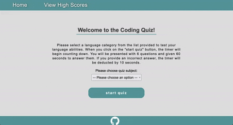

# Code Quiz Challenge
> This project was created as part of the Berkeley Codind Bootcamp week 4 challenge based on the [user story](#user-story) and [accetpance criteria](#acceptance-criteria)

> Live demo [_here_](https://userolena.github.io/code-quiz-challenge-module-4/). 


## Table of Contents
* [General Info](#general-information)
* [Technologies Used](#technologies-used)
* [Preview](#preview)
* [Setup](#setup)
* [Usage](#usage)
* [User Story](#user-story)
* [Acceptance Criteria](#acceptance-criteria)
* [Project Status](#project-status)
* [License](#MIT)


## General Information
- Code Quiz offers a dropdown menu with a selection of three coding subjects (HTML, JavaScript, and CSS) to choose from.
- For each subject, there are six questions presented with four answer options in a button format for each question.
- Once the user selects a subject for the quiz and clicks the `start` button, a timer begins counting down from `60 seconds`.
- If the user clicks on one of the answer buttons, the `<body>` and the selected `<button>` elements will change their background color to `red` if the answer is incorrect or `green` if the chosen answer is correct.
- In the event that the user selects a wrong answer, the `timer will subtract 10 seconds` from the remaining time.
- Once the user clicks on one of the provided answer buttons, the web application automatically loads the next set of questions and answers.
- The quiz ends when the user answers all the provided questions within the provided timeframe, or when the timer reaches 0 seconds remaining.
- At the end of the quiz, the user is provided with their quiz result presented as a percentage, where 100% is the maximum achievable score.
- Upon completion of the quiz, the user is prompted to enter their initials to save their score result on the High Score Board.
- If the user provides their initials, the quiz result is saved to the Local Storage.
- The user can access the High Score Board at any time, even if the page is reloaded, unless they click the `Clear High Scores` button. If the user clicks this button, all data related to the Quiz Results will be deleted from the Local Storage.


## Technologies Used
- JavaScript
- HTML5
- CSS
- localStorage API
- JSON


## Preview



## Setup
No setup required. Web ready app. Link for the web app provided in the header of README.


## Usage
The Code Quiz App is ready to use and does not require authentication. To start the quiz, simply click the [link](https://userolena.github.io/code-quiz-challenge-module-4/)


## User Story
```
AS A coding boot camp student
I WANT to take a timed quiz on JavaScript fundamentals that stores high scores
SO THAT I can gauge my progress compared to my peers
```


## Acceptance Criteria
```
GIVEN I am taking a code quiz
WHEN I click the start button
THEN a timer starts and I am presented with a question
WHEN I answer a question
THEN I am presented with another question
WHEN I answer a question incorrectly
THEN time is subtracted from the clock
WHEN all questions are answered or the timer reaches 0
THEN the game is over
WHEN the game is over
THEN I can save my initials and score
```


## Project Status
Project is: _complete_


## License
This project is open source and available under the [MIT License]().
